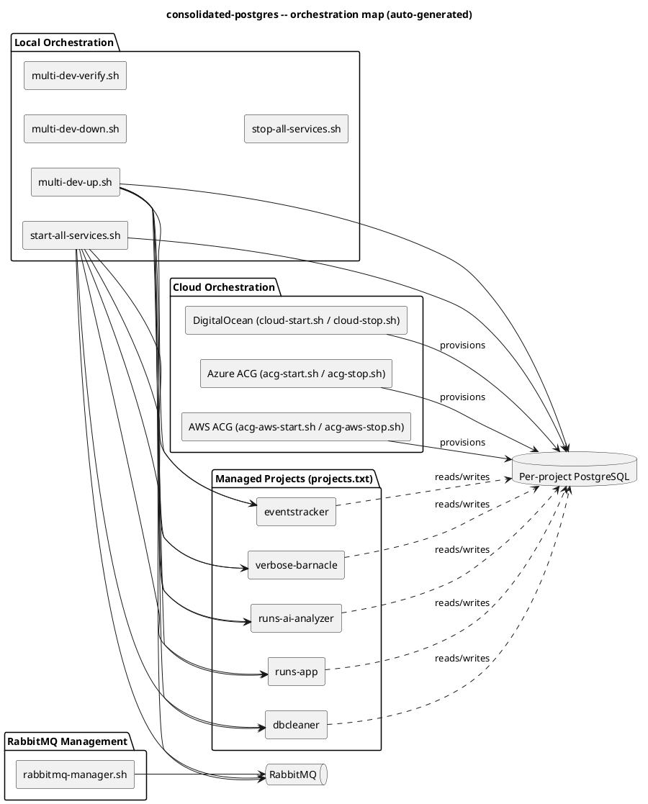

# consolidated-postgres

Shared local & cloud orchestration layer for the `IdeaProjects` workspace. This repo contains **no application code** —
it starts, stops, verifies, and tears down the PostgreSQL databases and RabbitMQ broker that `eventstracker`,
`runs-app`, and
`runs-ai-analyzer` depend on, both locally (Docker) and in temporary cloud sandboxes (DigitalOcean, Azure ACG, AWS ACG).

## Repository layout

| Path                                                                                   | Purpose                                                                                                                                  |
|----------------------------------------------------------------------------------------|------------------------------------------------------------------------------------------------------------------------------------------|
| `scripts/local/`                                                                       | Local dev orchestration — `multi-dev-up.sh`, `multi-dev-down.sh`, `multi-dev-verify.sh`, `start-all-services.sh`, `stop-all-services.sh` |
| `scripts/lib/project-config.sh`                                                        | Shared project metadata (ports, DB names, containers, env keys)                                                                          |
| `projects.txt`                                                                         | Source of truth for which projects are managed by the orchestration scripts                                                              |
| `cloud-start.sh` / `cloud-stop.sh`                                                     | DigitalOcean managed Postgres, on-demand                                                                                                 |
| `acg-start.sh` / `acg-stop.sh`                                                         | Azure ACG sandbox — Postgres Flexible Server                                                                                             |
| `acg-aws-start.sh` / `acg-aws-stop.sh`                                                 | AWS ACG sandbox — Docker `pgvector` on EC2 via SSM tunnel                                                                                |
| `rabbitmq-manager.sh`, `rabbitmq-compose.yml` | RabbitMQ lifecycle                                                                                                                       |
| `tests/`                                                                               | bats test suites — run with `./tests/run-tests.sh`                                                                                       |
| `backups/`                                                                             | `pg_dump` output from cloud teardown (gitignored)                                                                                        |
| `docs/`                                                                                | Workflow and architecture docs                                                                                                           |

## Architecture

<!-- AUTO-GENERATED:ARCHITECTURE:START -->


<details>
<summary>PlantUML source (also at <code>docs/architecture.puml</code>)</summary>


</details>
<!-- AUTO-GENERATED:ARCHITECTURE:END -->

## Quick start — local dev

```bash
cd consolidated-postgres
./scripts/local/multi-dev-up.sh        # start Postgres containers + RabbitMQ
./scripts/local/multi-dev-verify.sh    # guardrail checks
./scripts/local/start-all-services.sh  # start eventstracker -> runs-app -> runs-ai-analyzer in order
```

Reset to a clean slate: `./scripts/local/multi-dev-up.sh --reset`

| Project          | App port | DB port | DB name               | Container             |
|------------------|----------|---------|-----------------------|-----------------------|
| eventstracker    | 9081     | 6433    | `event-service`       | `event-service-db`    |
| runs-app         | 8080     | 5443    | `runsapp_db`          | `runs-app-postgres`   |
| runs-ai-analyzer | 8081     | 5444    | `runs_ai_analyzer_db` | `runs-ai-analyzer-db` |

## VM databases (VirtualBox + Portainer)

Run persisted project databases on the VirtualBox VM instead of (or alongside) local Docker:

```bash
cp vm.env.example vm.env                          # one-time: VM IP + Portainer API key
./scripts/vm/vm-db-up.sh runs-app runs-ai-analyzer  # DBs for the projects you pass
```

Regenerates the managed block in `docker-compose-vm.yml`, syncs each selected project's own compose
file, rewrites its `.env` JDBC URL to the VM (or back to localhost with `--target local`), and redeploys the Portainer
stack via API. Data lives in named volumes on the VM. See [docs/VM_WORKFLOW.md](docs/VM_WORKFLOW.md).

## Cloud database options

| Scripts                                | Provider          | Notes                                                                                                                                      |
|----------------------------------------|-------------------|--------------------------------------------------------------------------------------------------------------------------------------------|
| `cloud-start.sh` / `cloud-stop.sh`     | DigitalOcean      | Managed Postgres cluster, ~$0.50/day while running                                                                                         |
| `acg-start.sh` / `acg-stop.sh`         | Azure ACG sandbox | Postgres Flexible Server via targeted `terraform apply` against `../iAC-NikeRuns`                                                          |
| `acg-aws-start.sh` / `acg-aws-stop.sh` | AWS ACG sandbox   | `pgvector/pgvector:pg16` in Docker on an EC2 t3.micro, reached via SSM port-forwarding tunnel (managed RDS is blocked by SCP `p-cr6s9vs4`) |

All three `*-stop.sh` scripts `pg_dump` every database to `backups/` before tearing down infrastructure.

## RabbitMQ

```bash
./rabbitmq-manager.sh start|stop|restart|status|logs|clean
```

See [RABBITMQ-README.md](RABBITMQ-README.md) for details.

## Testing

```bash
./tests/run-tests.sh            # all bats suites (auto-installs bats-core if needed)
./tests/run-tests.sh unit        # unit tests only
./tests/run-tests.sh integration # integration tests only
```

## Documentation index

- [START_HERE.md](START_HERE.md) — prerequisites & new-machine setup
- [docs/LOCAL_ENV_WORKFLOW.md](docs/LOCAL_ENV_WORKFLOW.md) — local/cloud toggle & guardrails
- [EVENT_DRIVEN_STARTUP.md](EVENT_DRIVEN_STARTUP.md) — correct service startup order
- [RABBITMQ-README.md](RABBITMQ-README.md) — RabbitMQ management utilities

## Repository status

<!-- AUTO-GENERATED:STATUS:START -->
_Generated from `projects.txt` and the scripts present in the repo as of `725ec01`._

| Script                                | Present | Description                                                                 |
|---------------------------------------|---------|-----------------------------------------------------------------------------|
| `scripts/local/multi-dev-up.sh`       | yes     | Multi-project Development Environment Startup                               |
| `scripts/local/multi-dev-down.sh`     | yes     | Multi-project Development Environment Shutdown                              |
| `scripts/local/multi-dev-verify.sh`   | yes     | Guardrail verification script to ensure our multi-service local environment |
| `scripts/local/start-all-services.sh` | yes     | Automated Service Startup with Correct Ordering                             |
| `scripts/local/stop-all-services.sh`  | yes     | Stop All Spring Boot Services                                               |
| `cloud-start.sh`                      | yes     | On-Demand Cloud Database Startup                                            |
| `cloud-stop.sh`                       | yes     | On-Demand Cloud Database Shutdown                                           |
| `acg-start.sh`                        | yes     | ACG Azure Sandbox — Shared PostgreSQL Startup                               |
| `acg-stop.sh`                         | yes     | ACG Azure Sandbox — PostgreSQL Teardown                                     |
| `acg-aws-start.sh`                    | yes     | ACG AWS Sandbox — PostgreSQL via SSM (Docker on EC2)                        |
| `acg-aws-stop.sh`                     | yes     | ACG AWS Sandbox — PostgreSQL Teardown                                       |
| `rabbitmq-manager.sh`                 | yes     | RabbitMQ Manager - Comprehensive utility for managing RabbitMQ containers   |

| Managed project    | DB port | DB name               |
|--------------------|---------|-----------------------|
| `eventstracker`    | 6433    | `event-service`       |
| `runs-app`         | 5443    | `runsapp_db`          |
| `runs-ai-analyzer` | 5444    | `runs_ai_analyzer_db` |
| `verbose-barnacle` | 5439    | `my-github-cleaner`   |
| `dbcleaner`        | 5433    | `dbcleaner`           |
<!-- AUTO-GENERATED:STATUS:END -->

## Keeping this README in sync

The **Architecture** and **Repository status** sections above are generated by
[`scripts/update_readme.py`](scripts/update_readme.py) from the actual contents of
`projects.txt` and the orchestration scripts — not hand-maintained.

A pre-commit hook regenerates these sections (and re-stages `README.md` if they changed) on every commit. Enable it once
per clone:

```bash
./scripts/install-git-hooks.sh
```

To regenerate manually:

```bash
python3 scripts/update_readme.py
```